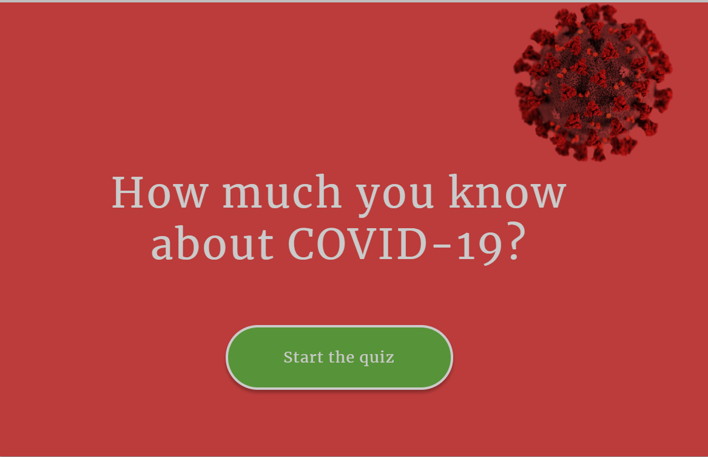

# covid-19-js-quiz

<h2> How much you know about the new Covid-19 ? </h2>  
Thinking on that I decided to create this simple quiz that can be scalable as more questions are answered about this new virus.
It was built with Vanilla Java Script , HTML and CSS. No Frameworks.  
Content/Topics covered: Arrays, Arrays Methods, DOM manipulation, CSS Classes. 

<h5>Be safe!</h5>

Screen Shot
  

<h2> Link to Deployed Application </h2>

Check it out!  
[https://cibellem.github.io/covid-19-js-quiz/]
